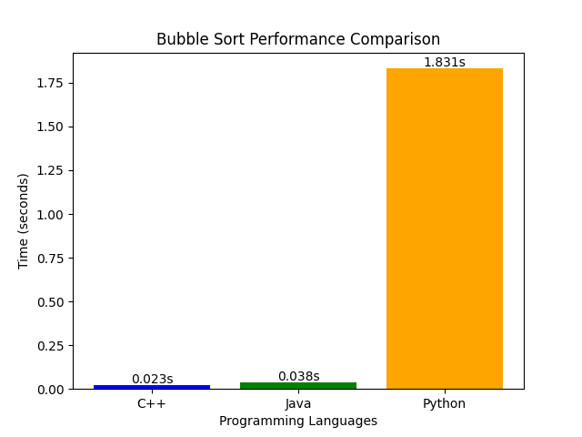

# Sorting Algorithms Performance Analysis

This project focuses on implementing and benchmarking sorting algorithms, starting with **Bubble Sort**, across multiple programming languages (**Python**, **C++**, and **Java**). The goal is to analyze runtime differences when sorting identical datasets and visualize the performance comparison.

---

## 📊 Results: Bubble Sort Performance

The following chart illustrates the runtime performance of Bubble Sort implemented in **Python**, **C++**, and **Java** for a dataset of 10,000 integers.

---
